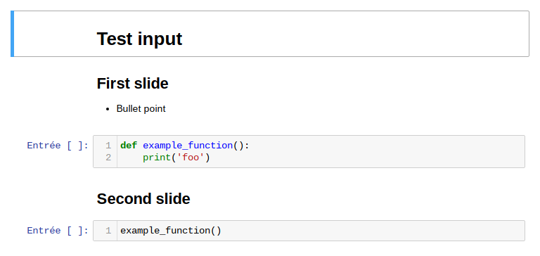

Lucina
======

From markdown to Jupyter notebook.

https://pypi.org/project/lucina/

Create a Jupyter notebook with Python & Markdown fragments from mardkwon files.

## Example

Running `lucina` on file [input.md](docs/input.md).

```shell
lucina -o docs/output.ipynb docs/input.md
```

It outputs file [output.ipynb](docs/output.ipynb) that looks like:


